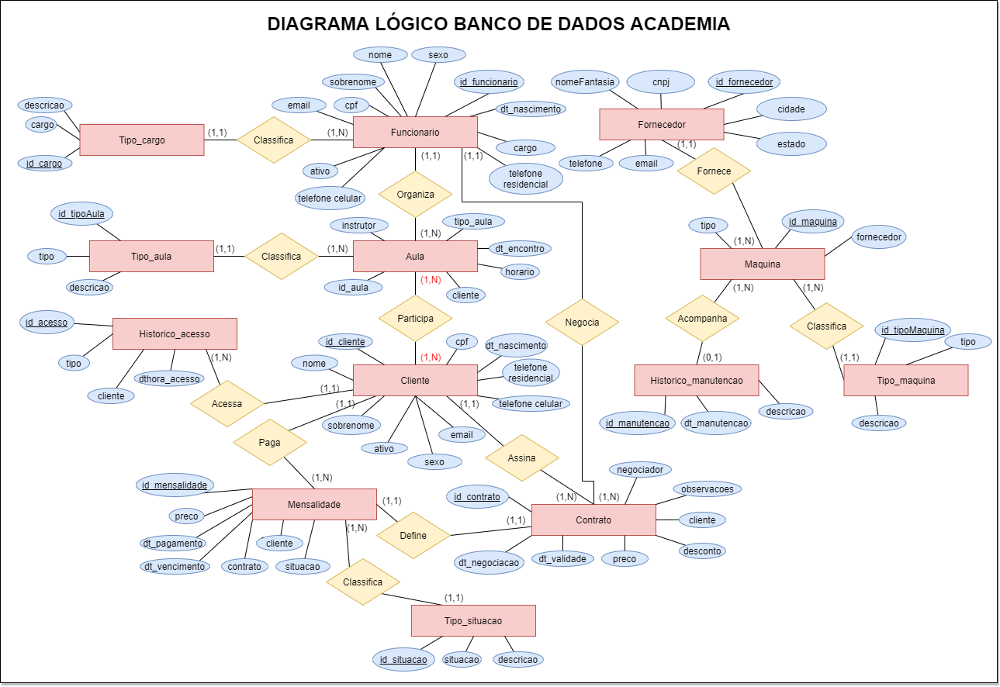

# Banco de Dados Checkpoint 1

## Proposta da atividade

> Criar um modelo lógico de um banco de dados. Pode ser de um negócio ou uma aplicação. (Por exemplo: uma biblioteca). O modelo lógico deve ter, no mínimo, em sua estrutura básica: entidades, atributos e relacionamentos.

## SQL_scripts

### OBS: Faça uso dos Scripts utilizando o MySQL para garantir a correta funcionalidade

- **db_creation.sql**: Criação do banco de dados e definição das tabelas. Pode ser usado para resetar o schema.
- **db_data_insertion**: Inserção de dados fictícios nas tabelas para testes.

## Diagramas

- Diagrama Lógico:

- Diagrama Físico:

