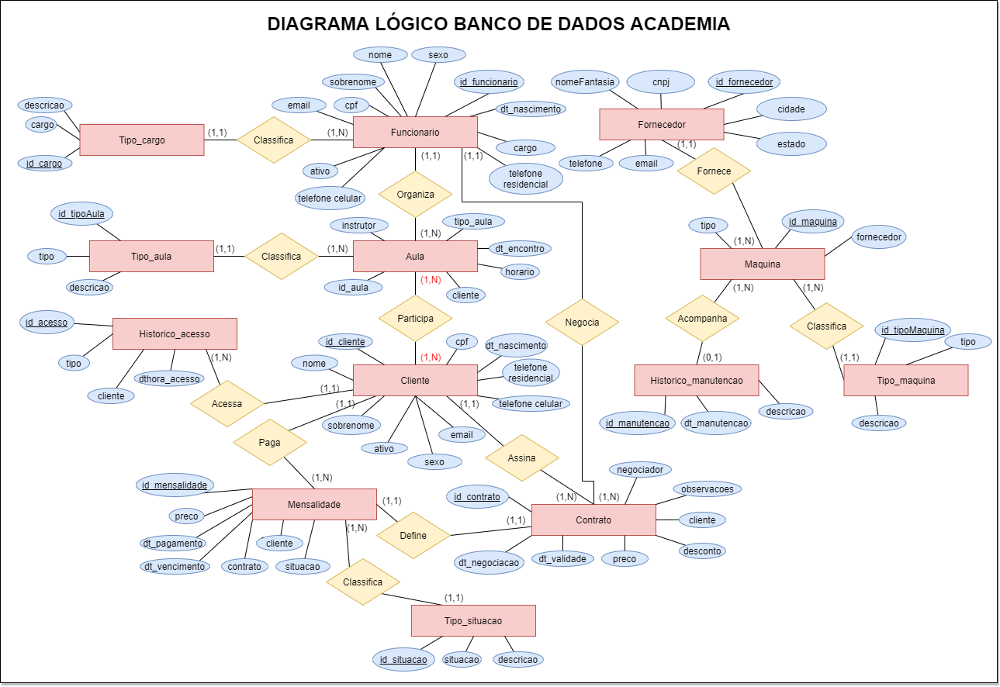
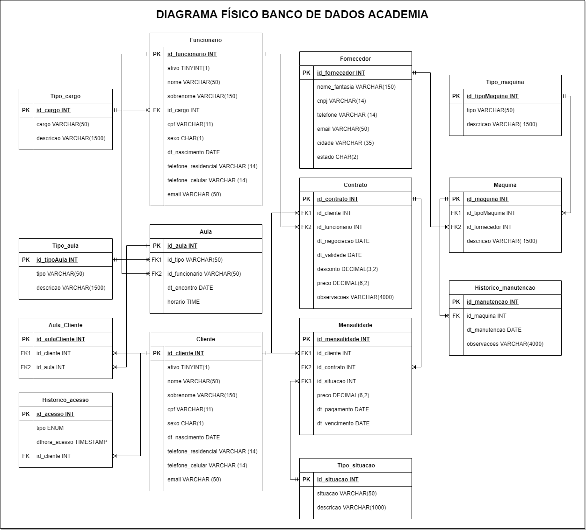

# Banco de Dados Checkpoint 1

## Proposta da atividade

> Criar um modelo lógico de um banco de dados, pode ser de um negócio ou uma aplicação. (Por exemplo: uma biblioteca). O modelo lógico deve ter, no mínimo, em sua estrutura básica: entidades, atributos e relacionamentos.

## Diagramas

- Diagrama Lógico:

- Diagrama Físico:

